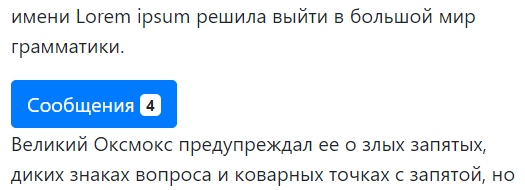
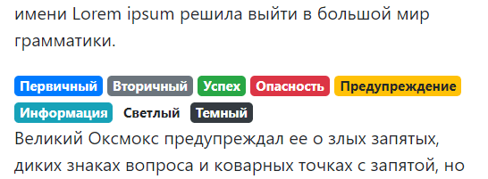
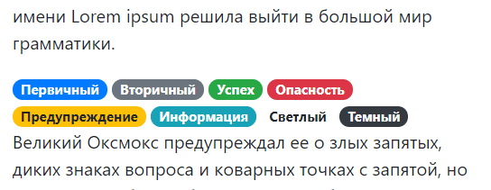

### Badge

```html
<button type="button" class="btn btn-primary">
    Сообщения <span class="badge badge-light">4</span>
</button>
```



```html
<span class="badge badge-primary">Первичный</span>
<span class="badge badge-secondary">Вторичный</span>
<span class="badge badge-success">Успех</span>
<span class="badge badge-danger">Опасность</span>
<span class="badge badge-warning">Предупреждение</span>
<span class="badge badge-info">Информация</span>
<span class="badge badge-light">Светлый</span>
<span class="badge badge-dark">Темный</span>
```



```html
<span class="badge badge-pill badge-primary">Первичный</span>
<span class="badge badge-pill badge-secondary">Вторичный</span>
<span class="badge badge-pill badge-success">Успех</span>
<span class="badge badge-pill badge-danger">Опасность</span>
<span class="badge badge-pill badge-warning">Предупреждение</span>
<span class="badge badge-pill badge-info">Информация</span>
<span class="badge badge-pill badge-light">Светлый</span>
<span class="badge badge-pill badge-dark">Темный</span>
```

