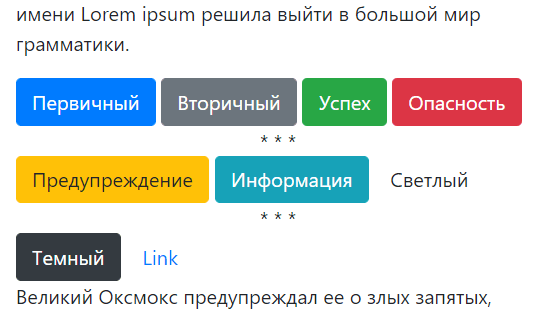
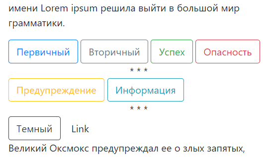
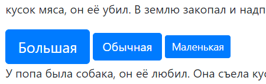
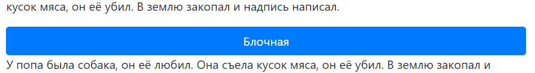

### Button

```html
<button type="button" class="btn btn-primary">Первичный</button>
<button type="button" class="btn btn-secondary">Вторичный</button>
<button type="button" class="btn btn-success">Успех</button>
<button type="button" class="btn btn-danger">Опасность</button>
<center>* * *</center>
<button type="button" class="btn btn-warning">Предупреждение</button>
<button type="button" class="btn btn-info">Информация</button>
<button type="button" class="btn btn-light">Светлый</button>
<center>* * *</center>
<button type="button" class="btn btn-dark">Темный</button>
<button type="button" class="btn btn-link">Link</button>
```



```html
<button type="button" class="btn btn-outline-primary">Первичный</button>
<button type="button" class="btn btn-outline-secondary">Вторичный</button>
<button type="button" class="btn btn-outline-success">Успех</button>
<button type="button" class="btn btn-outline-danger">Опасность</button>
<center>* * *</center>
<button type="button" class="btn btn-outline-warning">Предупреждение</button>
<button type="button" class="btn btn-outline-info">Информация</button>
<button type="button" class="btn btn-outline-light">Светлый</button>
<center>* * *</center>
<button type="button" class="btn btn-outline-dark">Темный</button>
<button type="button" class="btn btn-outline-link">Link</button>
```




Кнопки бывают обычные, большие и маленькие:

```html
<button type="button" class="btn btn-lg btn-primary">Большая</button>
<button type="button" class="btn btn-primary">Обычная</button>
<button type="button" class="btn btn-sm btn-primary">Маленькая</button>
```



В обычном состоянии ширина кнопки определяется её размером, но можно сделать блочную кнопку, которая автоматически растянется на всю доступную ширину.

```html
<button type="button" class="btn btn-block btn-primary">Блочная</button>
```



#### Чекбоксы

