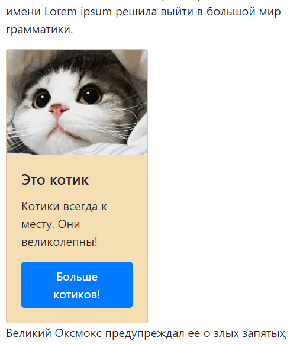
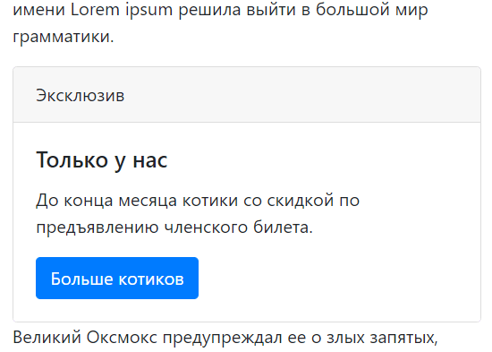
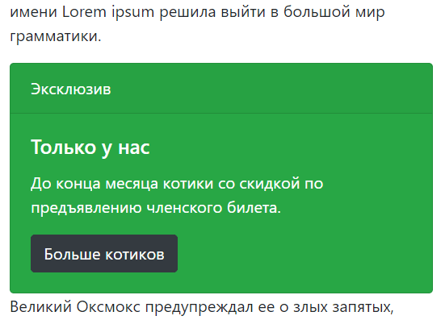
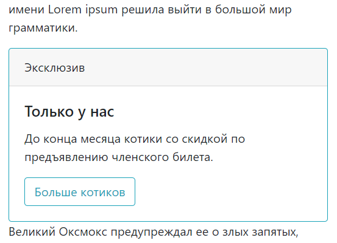
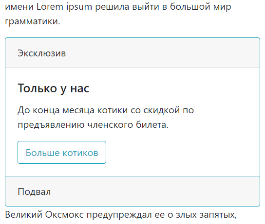
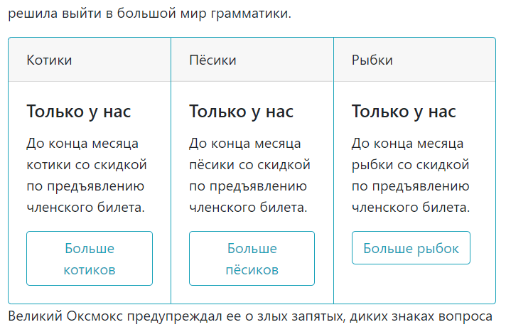

### Card

```html
<div class="card" style="width: 12rem; background-color: wheat">
    
    <div class="card-body">
        <h5 class="card-title">Это котик</h5>
        <p class="card-text">Котики всегда к месту. Они великолепны!</p>
        <a href="#" class="btn btn-primary">Больше котиков!</a>
    </div>
</div>
```



```html
<div class="card">
    <div class="card-header">
        Эксклюзив
    </div>
    <div class="card-body">
        <h5 class="card-title">Только у нас</h5>
        <p class="card-text">До конца месяца котики со скидкой по предъявлению членского билета.</p>
        <a href="#" class="btn btn-primary">Больше котиков</a>
    </div>
</div>
```



```html
<div class="card text-white bg-success">
    <div class="card-header">
        Эксклюзив
    </div>
    <div class="card-body">
        <h5 class="card-title">Только у нас</h5>
        <p class="card-text">До конца месяца котики со скидкой по предъявлению членского билета.</p>
        <a href="#" class="btn btn-dark">Больше котиков</a>
    </div>
</div>
```



```html
<div class="card border-info">
    <div class="card-header">
        Эксклюзив
    </div>
    <div class="card-body">
        <h5 class="card-title">Только у нас</h5>
        <p class="card-text">До конца месяца котики со скидкой по предъявлению членского билета.</p>
        <a href="#" class="btn btn-outline-info">Больше котиков</a>
    </div>
</div>
```



```html
<div class="card border-info mb-0">
    <div class="card-header">
        Эксклюзив
    </div>
    <div class="card-body">
        <h5 class="card-title">Только у нас</h5>
        <p class="card-text">До конца месяца котики со скидкой по предъявлению членского билета.</p>
        <a href="#" class="btn btn-outline-info">Больше котиков</a>
    </div>
    <div class="card-footer border-info">Подвал</div>
</div>
```



```html
<div class="card-group">
    <div class="card border-info mb-0">
        <div class="card-header">
            Котики
        </div>
        <div class="card-body">
            <h5 class="card-title">Только у нас</h5>
            <p class="card-text">До конца месяца котики со скидкой по предъявлению членского билета.</p>
            <a href="#" class="btn btn-outline-info">Больше котиков</a>
        </div>
    </div>
    <div class="card border-info mb-0">
        <div class="card-header">
            Пёсики
        </div>
        <div class="card-body">
            <h5 class="card-title">Только у нас</h5>
            <p class="card-text">До конца месяца пёсики со скидкой по предъявлению членского билета.</p>
            <a href="#" class="btn btn-outline-info">Больше пёсиков</a>
        </div>
    </div>
    <div class="card border-info mb-0">
        <div class="card-header">
            Рыбки
        </div>
        <div class="card-body">
            <h5 class="card-title">Только у нас</h5>
            <p class="card-text">До конца месяца рыбки со скидкой по предъявлению членского билета.</p>
            <a href="#" class="btn btn-outline-info">Больше рыбок</a>
        </div>
    </div>
</div>
```

