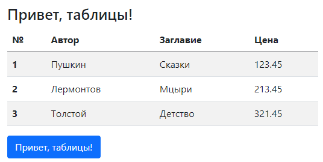

### Таблицы в Bootstrap



```html
<div class="container">

    <h3 class="mt-3">Привет, таблицы!</h3>

    <table class="table table-striped">
        <thead>
        <tr>
            <th scope="col">№</th>
            <th scope="col">Автор</th>
            <th scope="col">Заглавие</th>
            <th scope="col">Цена</th>
        </tr>
        </thead>
        <tbody>
        <tr>
            <th scope="row">1</th>
            <td>Пушкин</td>
            <td>Сказки</td>
            <td>123.45</td>
        </tr>
        <tr>
            <th scope="row">2</th>
            <td>Лермонтов</td>
            <td>Мцыри</td>
            <td>213.45</td>
        </tr>
        <tr>
            <th scope="row">3</th>
            <td>Толстой</td>
            <td>Детство</td>
            <td>321.45</td>
        </tr>
        </tbody>
    </table>

    <button class="btn btn-primary">Привет, таблицы!</button>
</div>
```

Варианты оформления: `table-primary` (`secondary` и т. д.), `table-dark` (`light`), `table-hover` (подсветка активной строки внутри `tbody`).

Варианты `primary/secondary/...` можно применять как отдельным строкам

```html
<tr class="table-danger">....</tr>
```

и отдельным ячейкам

```html
<td class="table-danger">....</td>
```

Таблица со всеми рамками:

```html
<table class="table table-bordered border-primary">
  ...
</table>
```

и без рамок вообще

```html
<table class="table table-borderless">
  ...
</table>
```

Компактная таблица:

```html
<table class="table table-sm">
  ...
</table>
```

Выравнивание ячеек по вертикали:

```html
<div class="table-responsive">
  <table class="table align-middle">
    <thead>
      <tr>
        ...
      </tr>
    </thead>
    <tbody>
      <tr>
        ...
      </tr>
      <tr class="align-bottom">
        ...
      </tr>
      <tr>
        <td>...</td>
        <td>...</td>
        <td class="align-top">This cell is aligned to the top.</td>
        <td>...</td>
      </tr>
    </tbody>
  </table>
</div>
```

Выделение верхней строки таблицы:

```html
<table class="table">
  <thead class="table-dark">
    ...
  </thead>
  <tbody>
    ...
  </tbody>
</table>
```

Подвал таблицы:

```html
<table class="table">
  <thead>
    ...
  </thead>
  <tbody>
    ...
  </tbody>
  <tfoot>
    ...
  </tfoot>
</table>
```

Заголовок таблицы:

```html
<table class="table table-sm">
  <caption>List of users</caption>
  <thead>
    ...
  </thead>
  <tbody>
    ...
  </tbody>
</table>
```
