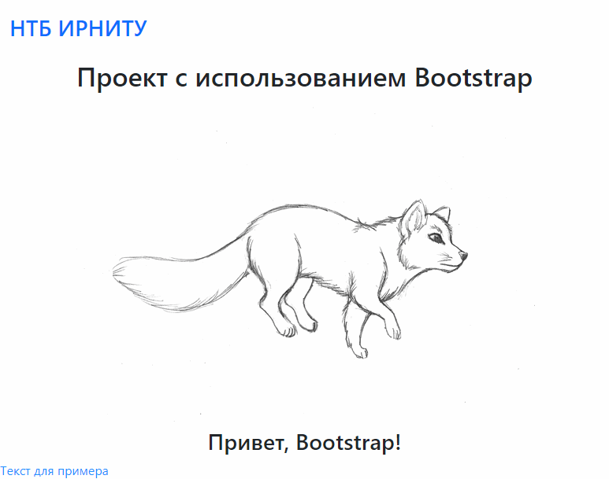

### Bootstrap 5 с Webpack 5

Создаем пустой проект Node.js и добавляем в него Bootstrap и Webpack с "приправами":

```shell
mkdir sample
cd sample
npm init -y
npm i webpack webpack-cli webpack-dev-server html-webpack-plugin style-loader css-loader path --save-dev
npm i @popperjs/core bootstrap
```

* **webpack** - собственно Webpack,
* **webpack-cli** - позволяет вызывать Webpack из командной строки,
* **webpack-dev-server** - сервер для автоматического отслеживания изменений в редактируемых файлах и моментальному отображению их в браузере,
* **html-webpack-plugin** - плагин для копирования HTML-файла в продакшн-папку (устраняет необходимость ручного копирования),
* **style-loader** - подключает обработку стилевых файлов,
* **css-loader** - обработка конкретно CSS-файлов,
* **path** - работа с путями,
* **popperjs** - пакет, используемый для отображения всплывающих оповещений (используется Bootstrap),
* **bootstrap** - ради него всё и затевалось.

Создаем папку `src` с подпапками `img`, `css` и `js`.

В папке `src` создаем файл `index.html`:

```html
<!DOCTYPE html>
<html lang="ru">
<head>
    <meta charset="UTF-8">
    <title>Проект с Bootstrap</title>
</head>
<body>

<nav class="navbar navbar-expand-sm navbar-light bg-light">
    <div class="container-fluid">
        <ul class="navbar-nav me-auto mb-2 mb-lg-0">
            <li class="nav-item text-primary">
                <a href="http://library.istu.edu" style="text-decoration: none;">
                    <h2 style="padding-top: 10px;">НТБ ИРНИТУ</h2>
                </a>
            </li>
        </ul>
    </div>
</nav>

<div class="container">

    <div class="row">
        <div class="col">
            <h1 class="text-center">Проект с использованием Bootstrap</h1>
        </div>
    </div>

    <div class="row">
        <div class="col">
            <h2 class="text-center" id>
                
            </h2>
        </div>
    </div>

    <div class="row">
        <div class="col">
            <h2 class="text-center" id="placeholder"></h2>
        </div>
    </div>

</div>

<div class="sample">
    <p>Текст для примера</p>
</div>

<script defer src="bundle.js"></script>

</body>
</html>
```

В папке `js` создаем два файла. Первый - `app.js` - служит точкой входа в приложение. Его задача - импортировать всё необходимое

```js
import 'bootstrap/dist/css/bootstrap.min.css'
import './our'
import './../css/styles.css'
import './../img/arctic-fox.gif'
import './../img/favicon.ico'
import './../img/logo.png'
```

Второй - `our.js` - это некий модуль, написанный нами специально для данного приложения. Что он делает - определяется только нашей фантазией

```js
setTimeout(function () {
    const placeholder = document.getElementById ('placeholder')
    placeholder.innerHTML = 'Привет, Bootstrap!'
})
```

В папке `css` создадим файл `styles.css`, в котором будут содержаться разработанные нами стили

```css
.sample {
    color: dodgerblue;
}
```

В папку `img` помещаем необходимые нам картинки, например, изображение полярной лисы.

Файл `package.json` должен выглядеть примерно так

```json
{
  "name": "boot-pack",
  "version": "1.0.0",
  "description": "Шаблон проекта с Bootstrap и Webpack",
  "main": ".src/js/app.js",
  "repository": {
    "type": "git",
    "url": "https://github.com/amironov73/templates"
  },
  "homepage": "https://github.com/amironov73/templates/BootPack",
  "scripts": {
    "build": "webpack --mode=development --progress",
    "dev": "webpack serve --mode=development",
    "production": "webpack --mode=production --progress"
  },
  "keywords": [
    "bootstrap",
    "webpack",
    "template"
  ],
  "author": "Alexey Mironov <amironov73@gmail.com>",
  "license": "MIT",
  "devDependencies": {
    "css-loader": "^6.5.1",
    "file-loader": "^6.2.0",
    "html-webpack-plugin": "^5.5.0",
    "path": "^0.12.7",
    "style-loader": "^3.3.1",
    "webpack": "^5.65.0",
    "webpack-cli": "^4.9.1",
    "webpack-dev-server": "^4.6.0"
  },
  "dependencies": {
    "@popperjs/core": "^2.11.0",
    "bootstrap": "^5.1.3"
  }
}
```

Венчает это все файл `webpack.config.js`

```js
const path = require ('path')
const HtmlWebpackPlugin = require ('html-webpack-plugin')

module.exports = {
    entry: './src/js/app.js',
    plugins: [
        new HtmlWebpackPlugin ({
            template: './src/index.html',
            filename: 'index.html',
            inject: false
        })
    ],
    module: {
        rules: [
            {
                test: /\.css$/,
                use: [
                    'style-loader',
                    'css-loader'
                ]
            },
            {
                test: /\.(png|jpe?g|gif|ico)$/i,
                loader: 'file-loader',
                options: {
                    name: '[name].[ext]'
                }
            }
        ]
    },
    output: {
        path: path.resolve (__dirname, 'dist'),
        filename: 'bundle.js'
    }
}
```

Сборка проекта (результат должен помещаться в папку `dist`):

* **npm run build** - сборка отладочной версии,
* **npm run dev** - запуск отладочного веб-сервера с отслеживанием изменений, вносимых в исходные тексты,
* **npm run production** - сборка продакшн-версии.
    
Вот как выглядит результат:


