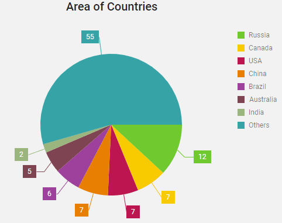

### PieChart



```vue
<template>
  <DxPieChart
      id="pie"
      :data-source="areas"
      palette="Bright"
      title="Area of Countries"
  >
    <DxSeries
        argument-field="country"
        value-field="area"
    >
      <DxLabel :visible="true">
        <DxConnector
            :visible="true"
            :width="1"
        />
      </DxLabel>
    </DxSeries>
    <DxSize :width="500"/>
  </DxPieChart>
</template>

<script>
import DxPieChart, {
  DxSize,
  DxSeries,
  DxLabel,
  DxConnector
} from 'devextreme-vue/pie-chart';

import { areas } from './data.js';

export default {
  components: {
    DxPieChart,
    DxSize,
    DxLabel,
    DxConnector,
    DxSeries
  },

  data() {
    return {
      areas
    };
  }
};
</script>
```

Здесь `data.js`:

```javascript
export const areas = [{
  country: 'Russia',
  area: 12
}, {
  country: 'Canada',
  area: 7
}, {
  country: 'USA',
  area: 7
}, {
  country: 'China',
  area: 7
}, {
  country: 'Brazil',
  area: 6
}, {
  country: 'Australia',
  area: 5
}, {
  country: 'India',
  area: 2
}, {
  country: 'Others',
  area: 55
}];
```