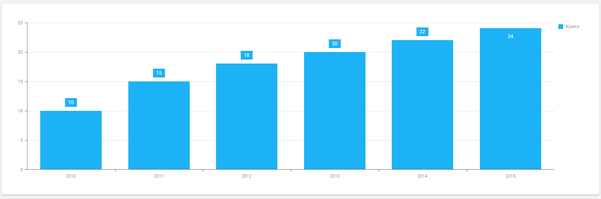

### Виджеты

### DxBox

Контейнер -- содержит произвольные элементы

```vue
<template>
    <DxBox
        direction="row"
        :height="100">
        <DxItem :ratio="1">
            <template #default>
                <div class="box-item orange"> Item 1 </div>
            </template>
        </DxItem>
        <DxItem :ratio="1">
            <template #default>
                <div class="box-item yellow"> Item 2 </div>
            </template>
        </DxItem>
        <DxItem :ratio="1">
            <template #default>
                <div class="box-item green"> Item 3 </div>
            </template>
        </DxItem>
    </DxBox>
</template>

<script>
import 'devextreme/dist/css/dx.common.css';
import 'devextreme/dist/css/dx.light.css';
 
import { DxBox, DxItem } from 'devextreme-vue/box';
 
export default {
    components: {
        DxBox,
        DxItem
    }
};
</script>

<style>
.box-item {
    text-align: center;
    padding-top: 34px;
    font-size: 16px;
}
 
.orange { background: #f39e6c }
.yellow { background: #f5e5a6 }
.green { background: #94d7c7 }
</style>
```

### DxAutocomplete

Текстовая строка с автодополнением.

```vue
<template>
  <DxAutocomplete
      :data-source="autocompleteData"
      placeholder="Введите город..."
  />
</template>

<script>
import DxAutocomplete from 'devextreme-vue/autocomplete';

export default {
  components: {
    DxAutocomplete
  },

  data() {
    return {
      autocompleteData: [
        "Иркутск",
        "Ангарск",
        "Шелехов",
        "Братск"
      ]
    };
  }

}
</script>
```

### DxButton

Обычная кнопка

```vue
<template>
  <DxButton
      text="Click me"
      @click="okClicked" 
  />
</template>

<script>
import DxButton from "devextreme-vue/button";
import notify from "devextreme/ui/notify";

export default {
  components: {
    DxButton
  },
  methods: {
    okClicked: function(e) {
      notify("The OK button was clicked");
    }
  }
}
</script>
```

### DxCheckBox

```vue
<template>
    <DxCheckBox
      style="padding: 2mm;"
      text="Чекни меня"
      v-model:value="checkBoxValue"
      @value-changed="handleValueChange"
    />
</template>

<script>
import DxCheckBox from 'devextreme-vue/check-box';
</script>
```

### DxNumberBox

```vue
<template>
  <DxNumberBox
      v-model:value="amount"
  />
</template>

<script>
import DxNumberBox from 'devextreme-vue/number-box';

</script>
```

### DxLookup

```vue
<template>
  <DxLookup
      :data-source="dataSource"
      placeholder="Выберите продукт..."
  />
</template>

<script>
import DxLookup from 'devextreme-vue/lookup';

export default
{
  components: {
    DxLookup
  },

  data() {
    return {
      dataSource: [
        'яблоки',
        'груши',
        'бананы',
        'лимоны',
        'огурцы',
        'помидоры',
        // ...
      ]
    };
  }
}

</script>

```

### DxLoadIndicator

```vue
<template>
  <DxButton
      text="Нажми"
      @click="toggleIndicator"
  />
  <DxLoadIndicator
      v-model:visible="indicatorVisible"
      width="30"
      height="30"
  />
</template>

<script>
import DxLoadIndicator from "devextreme-vue/load-indicator";
import DxButton from "devextreme-vue/button";

export default
{
  components: {
    DxLoadIndicator,
    DxButton
  },

  data() {
    return {
      indicatorVisible : true
    };
  },

  methods: {
    toggleIndicator: function () {
      this.indicatorVisible = !this.indicatorVisible;
    }
  }
}
</script>

```

### DxColorBox

Текстовый бокс для выбора цвета

```vue
<template>
  <DxColorBox
      v-model:value="color"
  />
</template>

<script>
import DxColorBox from 'devextreme-vue/color-box';

export default
{
  components: {
    DxColorBox
  },

  data() {
    return {
      color: "#FF0000"
    };
  }
}
</script>
```

### DxContextMenu

Контекстное меню, вызываемое правой кнопкой мыши

```vue
<template>
  
  <DxContextMenu
      :items="contextMenuItems"
      @item-click="itemClick"
      target="#someImage"
  />

<script>
  import DxContextMenu from 'devextreme-vue/context-menu';

  export default
  {
    components: {
      DxContextMenu
    },

    data() {
      return {
        contextMenuItems: [
          { text: 'Zoom In' },
          { text: 'Zoom Out' },
          {
            text: 'Share',
            items: [{
              text: 'Send to a friend',
              items: [
                { text: 'Log in with Facebook' },
                { text: 'Log in with Twitter' }
              ]
            }, {
              text: 'Send to a group',
              items: [
                { text: 'Log in with Facebook' },
                { text: 'Log in with Twitter' }
              ]
            }]
          },
          { text: 'Comment' }
        ]
      };
    },
    
    methods: {
      itemClick: function(e) {
        const { itemData, itemElement, itemIndex } = e;
        alert(itemData.text);
      }
    }
  }  
</script>  
</template>
```

### DxAccordion

Аккордион содержит несколько панелей, расположенных друг на другом. Эти панели могут быть свернуты или развернуты пользователем.

```vue
<template>
  <DxAccordion
      :data-source="accordionData"
      item-template="item">
    <template #item="{ data }">
      <div>
        <p v-for="key in getItemKeys(data)" v-bind:key="key">
          {{key}}: {{data[key]}}
        </p>
      </div>
    </template>
  </DxAccordion>
</template>

<script>
import DxAccordion from "devextreme-vue/accordion";

export default
{
  components: {
    DxAccordion
  },

  data() {
    return {
      accordionData: [{
        title: "Personal Data",
        firstName: "John",
        lastName: "Smith",
        birthYear: 1986
      }, {
        title: "Contacts",
        phone: "(555)555-5555",
        email: "John.Smith@example.com"
      }, {
        title: "Address",
        state: "CA",
        city: "San Francisco",
        street: "Stanford Ave"
      }]
    };
  },

  methods: {
    getItemKeys: function(item) {
      return Object.keys(item);
    }
  }
}
</script>
```

### DxChart



```vue
<template>
  <DxChart
      :data-source="books">
    <DxSeries
        type="bar"
        argument-field="year"
        value-field="amount"
        name="Книги"
    >
      <DxLabel
          :visible="true"
      />
    </DxSeries>
  </DxChart>
</template>

<script>
import { DxChart, DxSeries, DxLabel } from 'devextreme-vue/chart';

const books = [
  { year: "2010",  amount: 10 },
  { year: "2011",  amount: 15 },
  { year: "2012",  amount: 18 },
  { year: "2013",  amount: 20 },
  { year: "2014",  amount: 22 },
  { year: "2015",  amount: 24 },
];

export default
{
  components: {
    DxChart,
    DxSeries,
    DxLabel
  },

  data() {
    return {
      books
    };
  }
}
</script>
```

### DxDateBox

```vue
<template>
  <DxDateBox
      width="20%"
      type="datetime"
      :min="minDate"
      :max="now"
      v-model:value="theDate"
      @value-changed="onValueChanged"
  />
</template>

<script>
import { DxDateBox } from 'devextreme-vue/date-box';
</script>
```

### DxList

```vue
<template>
  <DxList
      width="20%"
      :dataSource="cities"
      :show-selection-controls="true"
      selection-mode="multiple"
      v-model:selected-items="selectedItems"
  />
</template>

<script>
import DxList from "devextreme-vue/list";
</script>
```

### DxHtmlEditor

```vue
<template>
  <DxHtmlEditor
      width="40%"
      value-type="html">
    <DxToolbar>
      <DxItem format-name="bold"/>
      <DxItem format-name="italic"/>
      <DxItem format-name="alignRight"/>
      <DxItem format-name="alignLeft"/>
    </DxToolbar>
    <p>
      У попа была <b>собака</b>. Он её <i>любил</i>.
      Она съела кусок мяса. Он её убил.
      В землю закопал и надпись написал.
    </p>
  </DxHtmlEditor>
</template>

<script>
import { DxHtmlEditor, DxToolbar, DxItem } from 'devextreme-vue/html-editor';

export default
{
    components: {
      DxHtmlEditor,
      DxToolbar,
      DxItem
    }
}
</script>
```

### DxTextBox

Имеются режимы: `email`, `tel`, `url`, `password`.

```vue
<template>
  <DxTextBox
      id="first"
      v-model:value="firstText"
      placeholder="Первое слово"
  />
  <DxTextBox
      id="second"
      v-model:value="secondText"
      placeholder="Второе слово"
  />
</template>

<script>
import { DxTextBox } from 'devextreme-vue/text-box';

export default {
  components: {
    DxTextBox
  },

  data() {
    return {
      firstText: "Hello",
      secondText: "World"
    };
  }
};
</script>
```

### DxTooltip

```vue
<template>
  
    <DxTooltip
        target="#image"
        show-event="dxhoverstart"
        hide-event="dxhoverend"
        >
      <p>У попа была собака, он ее любил.<br/>
        Она съела кусок мяса, он ее убил.</p>
    </DxTooltip>
</template>

<script>
import { DxTooltip } from 'devextreme-vue/tooltip';

export default {
  components: {
    DxTooltip
  }
};
</script>
```

### DxToolbar

```vue
<template>
  <div style="margin: 3%">
    <DxToolbar>
      <DxItem
          widget="dxButton"
          location="before"
          :options="{type: 'back', text: 'Back' }"
      />
      <DxItem
          widget="dxButton"
          :options="{type: 'new', text: 'New'}"
          @click="handler"
      />
      <DxItem
          widget="dxButton"
          :options="{type: 'clear', text: 'Clear'}"
          @click="handler"
      />
      <DxItem
          widget="dxButton"
          :options="{type: 'save', text: 'Save'}"
          @click="handler"
      />
      <DxItem
          widget="dxButton"
          :options="{type: 'products', text: 'Products'}"
          @click="handler"
      />
    </DxToolbar>
  </div>
</template>

<script>
import DxToolbar, { DxItem } from 'devextreme-vue/toolbar';
import notify from "devextreme/ui/notify";

export default {
  components: {
    DxToolbar,
    DxItem
  },

  methods: {
    handler: function(e) {
      notify(e.itemData.options.text);
    }
  }

};
</script>
```

### DxTileView


```vue
<template>
  <div style="margin: 3%">
    <DxTileView
        :data-source="dataSource"
        :base-item-height="40"
        :base-item-width="180"
        item-template="tile"
    >
      <template #tile="{ data }">
          <p style="font-size:larger"><b>{{data.text}}</b></p>
      </template>
    </DxTileView>
  </div>
</template>

<script>
import { DxTileView } from 'devextreme-vue/tile-view';

export default {
  components: {
    DxTileView
  },

  data() {
    return {
      dataSource: [
        { text: "Айдахо" },
        { text: "Айова" },
        { text: "Алабама" },
        { text: "Аляска" },
        { text: "Аризона" },
        { text: "Арканзас" },
        { text: "Вайоминг" },
        { text: "Вашингтон" },
        { text: "Вермонт" },
        { text: "Виргиния" },
        { text: "Висконсин" },
        { text: "Гавайи" },
        { text: "Делавэр" },
        { text: "Джорджия" },
        { text: "Западная Виргиния" },
        { text: "Иллинойс" },
        { text: "Индиана" },
        { text: "Калифорния" },
        { text: "Канзас" },
        { text: "Кентукки" },
        { text: "Колорадо" },
        { text: "Коннектикут" },
        { text: "Луизиана" },
        { text: "Массачусетс" },
        { text: "Миннесота" },
        { text: "Миссисипи" },
        { text: "Миссури" },
        { text: "Мичиган" },
        { text: "Монтана" },
        { text: "Мэн" },
        { text: "Мэриленд" },
        { text: "Небраска" },
        { text: "Невада" },
        { text: "Нью-Гэмпшир" },
        { text: "Нью-Джерси" },
        { text: "Нью-Йорк" },
        { text: "Нью-Мексико" },
        { text: "Огайо" },
        { text: "Оклахома" },
        { text: "Орегон" },
        { text: "Пенсильвания" },
        { text: "Род-Айленд" },
        { text: "Северная Дакота" },
        { text: "Северная Каролина" },
        { text: "Теннесси" },
        { text: "Техас" },
        { text: "Флорида" },
        { text: "Южная Дакота" },
        { text: "Южная Каролина" },
        { text: "Юта" }
      ]
    };
  }
};
</script>

<style lang="scss">
.dx-tile {
  border-radius: .5em;
  text-align: center;
  color: white;
  background: #8bc34a;

    &:hover {
    background: #f00;
  }
}
</style>
```

### DxSlider

```vue
<template>
    <DxSlider
        :min="0"
        :max="100"
        v-model:value="sliderValue"
    />
</template>

<script>
import { DxSlider } from 'devextreme-vue/slider';

export default {
  components: {
    DxSlider
  },

  data() {
    return {
      sliderValue: 44,
    };
  }

};
</script>
```

### DxProgressBar

```vue
<template>
    <DxProgressBar
        :min="0"
        :max="100"
        :value="progressValue"
    />
</template>

<script>
import { DxProgressBar } from 'devextreme-vue/progress-bar';

export default {
  components: {
    DxProgressBar
  },

  data() {
    return {
      progressValue: 44,
    };
  }

};
</script>
```
