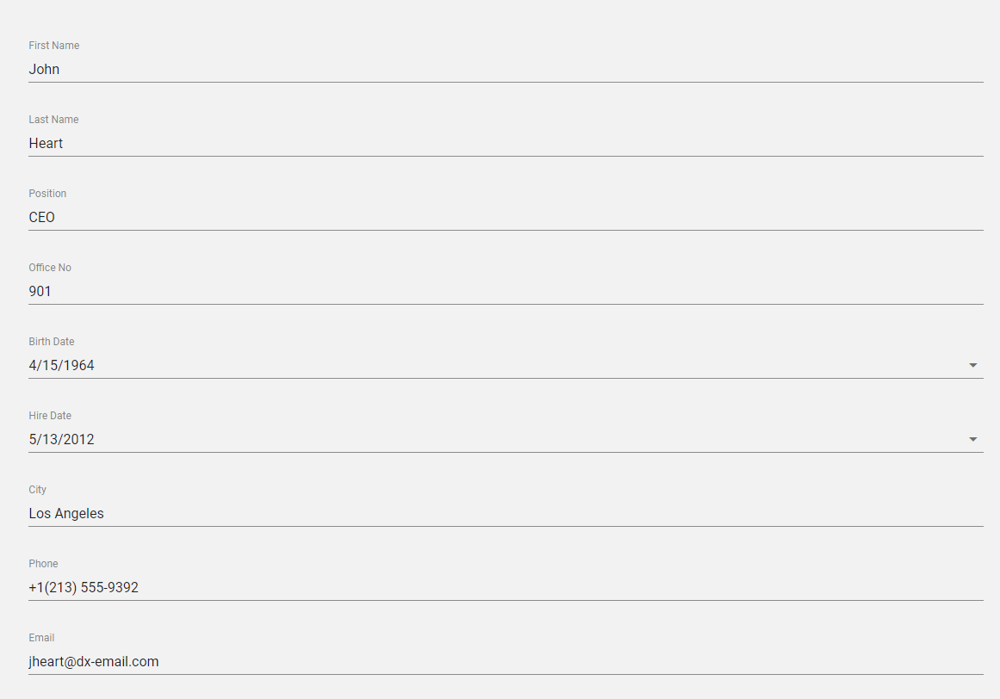

### Form



```vue
<template>
  <DxForm 
   width="90%"
   :form-data="employee" />
</template>

<script>
import DxForm from 'devextreme-vue/form';

const employee = {
    firstName: 'John',
    lastName: 'Heart',
    position: 'CEO',
    officeNo: 901,
    birthDate: new Date(1964, 3, 15),
    hireDate: new Date(2012, 4, 13),
    city: 'Los Angeles',
    phone: '+1(213) 555-9392',
    email: 'jheart@dx-email.com'
};

export default {
  components: {
    DxForm
  },

  data() {
    return {
      employee
    };
  }
};
</script>
```