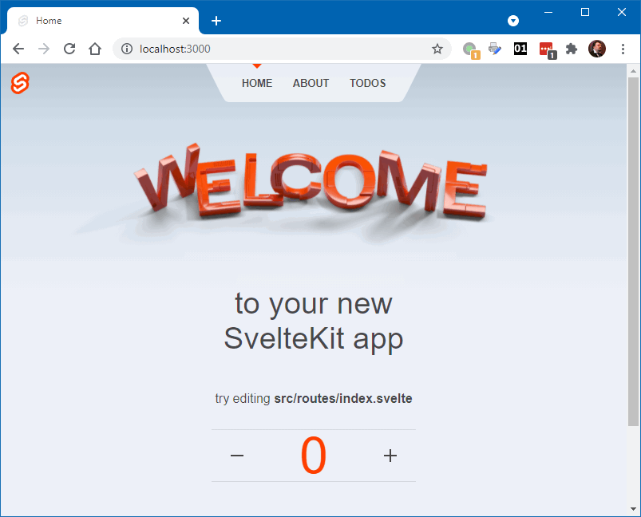
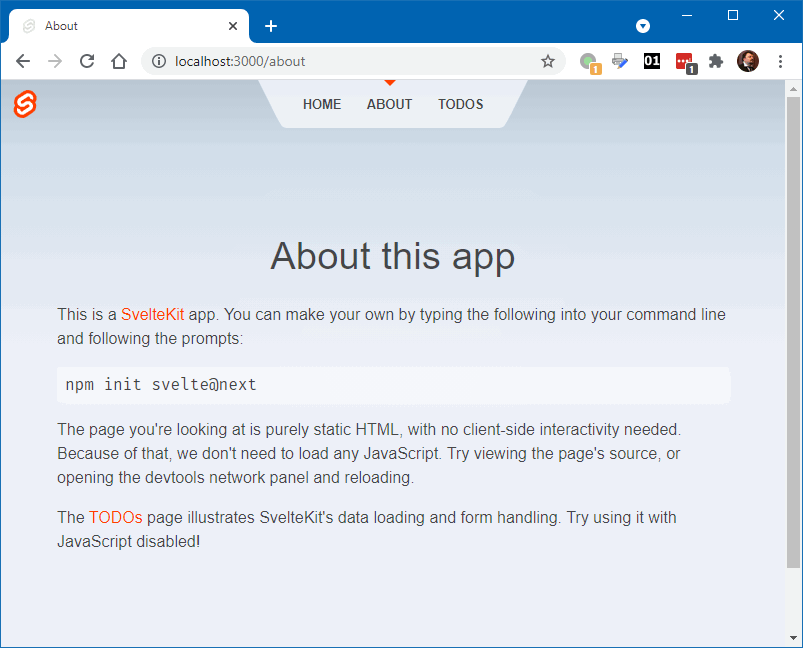
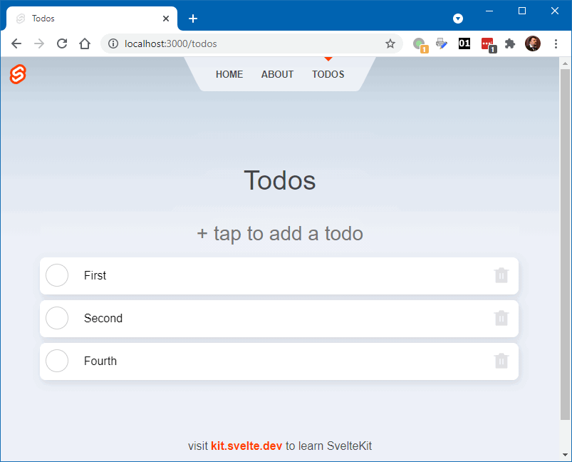

### Svelte Kit

Svelte Kit - фреймворк для создания приложений на Svelte.

```shell
> npm init svelte@next hello-kit
npx: installed 5 in 4.179s

create-svelte version 2.0.0-next.78

Welcome to SvelteKit!

This is beta software; expect bugs and missing features.

If you encounter a problem, open an issue on https://github.com/sveltejs/kit/issues 
if none exists already.

√ Which Svelte app template? » SvelteKit demo app
√ Use TypeScript? ... No / Yes
√ Add ESLint for code linting? ... No / Yes
√ Add Prettier for code formatting? ... No / Yes
✔ Copied project files

Want to add other parts to your code base? Visit https://github.com/svelte-add/svelte-adders, 
a community project of commands to add particular functionality to Svelte projects

Next steps:
  1: cd hello-kit
  2: npm install (or pnpm install, etc)
  3: git init && git add -A && git commit -m "Initial commit" (optional step)
  4: npm run dev -- --open

To close the dev server, hit Ctrl-C

Stuck? Visit us at https://svelte.dev/chat
```







`App.html`:

```html
<!DOCTYPE html>
<html lang="en">
	<head>
		<meta charset="utf-8" />
		<link rel="icon" href="/favicon.png" />
		<meta name="viewport" content="width=device-width, initial-scale=1" />

		%svelte.head%
	</head>
	<body>
		<div id="svelte">%svelte.body%</div>
	</body>
</html>
```

`hooks.js`

```javascript
import cookie from 'cookie';
import { v4 as uuid } from '@lukeed/uuid';

export const handle = async ({ request, resolve }) => {
	const cookies = cookie.parse(request.headers.cookie || '');
	request.locals.userid = cookies.userid || uuid();

	// TODO https://github.com/sveltejs/kit/issues/1046
	if (request.query.has('_method')) {
		request.method = request.query.get('_method').toUpperCase();
	}

	const response = await resolve(request);

	if (!cookies.userid) {
		// if this is the first time the user has visited this app,
		// set a cookie so that we recognise them when they return
		response.headers['set-cookie'] = `userid=${request.locals.userid}; Path=/; HttpOnly`;
	}

	return response;
};
```

`routes/__layout.svelte`:

```html
<script>
	import Header from '$lib/header/Header.svelte';
	import '../app.css';
</script>

<Header />

<main>
	<slot />
</main>

<footer>
	<p>visit <a href="https://kit.svelte.dev">kit.svelte.dev</a> to learn SvelteKit</p>
</footer>

<style>
	main {
		flex: 1;
		display: flex;
		flex-direction: column;
		padding: 1rem;
		width: 100%;
		max-width: 1024px;
		margin: 0 auto;
		box-sizing: border-box;
	}

	footer {
		display: flex;
		flex-direction: column;
		justify-content: center;
		align-items: center;
		padding: 40px;
	}

	footer a {
		font-weight: bold;
	}

	@media (min-width: 480px) {
		footer {
			padding: 40px 0;
		}
	}
</style>
```

`routes/index.svelte`:

```html
<script context="module">
	export const prerender = true;
</script>

<script>
	import Counter from '$lib/Counter.svelte';
</script>

<svelte:head>
	<title>Home</title>
</svelte:head>

<section>
	<h1>
		<div class="welcome">
			<picture>
				<source srcset="svelte-welcome.webp" type="image/webp" />
				
			</picture>
		</div>

		to your new<br />SvelteKit app
	</h1>

	<h2>
		try editing <strong>src/routes/index.svelte</strong>
	</h2>

	<Counter />
</section>

<style>
	section {
		display: flex;
		flex-direction: column;
		justify-content: center;
		align-items: center;
		flex: 1;
	}

	h1 {
		width: 100%;
	}

	.welcome {
		position: relative;
		width: 100%;
		height: 0;
		padding: 0 0 calc(100% * 495 / 2048) 0;
	}

	.welcome img {
		position: absolute;
		width: 100%;
		height: 100%;
		top: 0;
		display: block;
	}
</style>
```

`routes/about.svelte`:

```html
<script context="module">
    import { browser, dev } from '$app/env';

    // we don't need any JS on this page, though we'll load
    // it in dev so that we get hot module replacement...
    export const hydrate = dev;

    // ...but if the client-side router is already loaded
    // (i.e. we came here from elsewhere in the app), use it
    export const router = browser;

    // since there's no dynamic data here, we can prerender
    // it so that it gets served as a static asset in prod
    export const prerender = true;
</script>

<svelte:head>
    <title>About</title>
</svelte:head>

<div class="content">
    <h1>About this app</h1>

    <p>
        This is a <a href="https://kit.svelte.dev">SvelteKit</a> app. You can make your own by typing the
        following into your command line and following the prompts:
    </p>

    <!-- TODO lose the @next! -->
    <pre>npm init svelte@next</pre>

    <p>
        The page you're looking at is purely static HTML, with no client-side interactivity needed.
        Because of that, we don't need to load any JavaScript. Try viewing the page's source, or opening
        the devtools network panel and reloading.
    </p>

    <p>
        The <a href="/todos">TODOs</a> page illustrates SvelteKit's data loading and form handling. Try using
        it with JavaScript disabled!
    </p>
</div>

<style>
    .content {
        width: 100%;
        max-width: var(--column-width);
        margin: var(--column-margin-top) auto 0 auto;
    }
</style>
```

`routes/todos.index.svelte`:

```html
<script context="module">
	import { enhance } from '$lib/form';

	// see https://kit.svelte.dev/docs#loading
	export const load = async ({ fetch }) => {
		const res = await fetch('/todos.json');

		if (res.ok) {
			const todos = await res.json();

			return {
				props: { todos }
			};
		}

		const { message } = await res.json();

		return {
			error: new Error(message)
		};
	};
</script>

<script>
	import { scale } from 'svelte/transition';
	import { flip } from 'svelte/animate';

	export let todos;

	async function patch(res) {
		const todo = await res.json();

		todos = todos.map((t) => {
			if (t.uid === todo.uid) return todo;
			return t;
		});
	}
</script>

<svelte:head>
	<title>Todos</title>
</svelte:head>

<div class="todos">
	<h1>Todos</h1>

	<form
		class="new"
		action="/todos.json"
		method="post"
		use:enhance={{
			result: async (res, form) => {
				const created = await res.json();
				todos = [...todos, created];

				form.reset();
			}
		}}
	>
		<input name="text" aria-label="Add todo" placeholder="+ tap to add a todo" />
	</form>

	{#each todos as todo (todo.uid)}
		<div
			class="todo"
			class:done={todo.done}
			transition:scale|local={{ start: 0.7 }}
			animate:flip={{ duration: 200 }}
		>
			<form
				action="/todos/{todo.uid}.json?_method=patch"
				method="post"
				use:enhance={{
					pending: (data) => {
						todo.done = !!data.get('done');
					},
					result: patch
				}}
			>
				<input type="hidden" name="done" value={todo.done ? '' : 'true'} />
				<button class="toggle" aria-label="Mark todo as {todo.done ? 'not done' : 'done'}" />
			</form>

			<form
				class="text"
				action="/todos/{todo.uid}.json?_method=patch"
				method="post"
				use:enhance={{
					result: patch
				}}
			>
				<input aria-label="Edit todo" type="text" name="text" value={todo.text} />
				<button class="save" aria-label="Save todo" />
			</form>

			<form
				action="/todos/{todo.uid}.json?_method=delete"
				method="post"
				use:enhance={{
					pending: () => (todo.pending_delete = true),
					result: () => {
						todos = todos.filter((t) => t.uid !== todo.uid);
					}
				}}
			>
				<button class="delete" aria-label="Delete todo" disabled={todo.pending_delete} />
			</form>
		</div>
	{/each}
</div>

<style>
	.todos {
		width: 100%;
		max-width: var(--column-width);
		margin: var(--column-margin-top) auto 0 auto;
		line-height: 1;
	}

	.new {
		margin: 0 0 0.5rem 0;
	}

	input {
		border: 1px solid transparent;
	}

	input:focus-visible {
		box-shadow: inset 1px 1px 6px rgba(0, 0, 0, 0.1);
		border: 1px solid #ff3e00 !important;
		outline: none;
	}

	.new input {
		font-size: 28px;
		width: 100%;
		padding: 0.5em 1em 0.3em 1em;
		box-sizing: border-box;
		background: rgba(255, 255, 255, 0.05);
		border-radius: 8px;
		text-align: center;
	}

	.todo {
		display: grid;
		grid-template-columns: 2rem 1fr 2rem;
		grid-gap: 0.5rem;
		align-items: center;
		margin: 0 0 0.5rem 0;
		padding: 0.5rem;
		background-color: white;
		border-radius: 8px;
		filter: drop-shadow(2px 4px 6px rgba(0, 0, 0, 0.1));
		transform: translate(-1px, -1px);
		transition: filter 0.2s, transform 0.2s;
	}

	.done {
		transform: none;
		opacity: 0.4;
		filter: drop-shadow(0px 0px 1px rgba(0, 0, 0, 0.1));
	}

	form.text {
		position: relative;
		display: flex;
		align-items: center;
		flex: 1;
	}

	.todo input {
		flex: 1;
		padding: 0.5em 2em 0.5em 0.8em;
		border-radius: 3px;
	}

	.todo button {
		width: 2em;
		height: 2em;
		border: none;
		background-color: transparent;
		background-position: 50% 50%;
		background-repeat: no-repeat;
	}

	button.toggle {
		border: 1px solid rgba(0, 0, 0, 0.2);
		border-radius: 50%;
		box-sizing: border-box;
		background-size: 1em auto;
	}

	.done .toggle {
		background-image: url("data:image/svg+xml,%3Csvg width='22' height='16' viewBox='0 0 22 16' fill='none' xmlns='http://www.w3.org/2000/svg'%3E%3Cpath d='M20.5 1.5L7.4375 14.5L1.5 8.5909' stroke='%23676778' stroke-width='1.5' stroke-linecap='round' stroke-linejoin='round'/%3E%3C/svg%3E");
	}

	.delete {
		background-image: url("data:image/svg+xml,%3Csvg width='24' height='24' viewBox='0 0 24 24' fill='none' xmlns='http://www.w3.org/2000/svg'%3E%3Cpath d='M4.5 5V22H19.5V5H4.5Z' fill='%23676778' stroke='%23676778' stroke-width='1.5' stroke-linejoin='round'/%3E%3Cpath d='M10 10V16.5' stroke='white' stroke-width='1.5' stroke-linecap='round' stroke-linejoin='round'/%3E%3Cpath d='M14 10V16.5' stroke='white' stroke-width='1.5' stroke-linecap='round' stroke-linejoin='round'/%3E%3Cpath d='M2 5H22' stroke='%23676778' stroke-width='1.5' stroke-linecap='round' stroke-linejoin='round'/%3E%3Cpath d='M8 5L9.6445 2H14.3885L16 5H8Z' fill='%23676778' stroke='%23676778' stroke-width='1.5' stroke-linejoin='round'/%3E%3C/svg%3E%0A");
		opacity: 0.2;
	}

	.delete:hover,
	.delete:focus {
		transition: opacity 0.2s;
		opacity: 1;
	}

	.save {
		position: absolute;
		right: 0;
		opacity: 0;
		background-image: url("data:image/svg+xml,%3Csvg width='24' height='24' viewBox='0 0 24 24' fill='none' xmlns='http://www.w3.org/2000/svg'%3E%3Cpath d='M20.5 2H3.5C2.67158 2 2 2.67157 2 3.5V20.5C2 21.3284 2.67158 22 3.5 22H20.5C21.3284 22 22 21.3284 22 20.5V3.5C22 2.67157 21.3284 2 20.5 2Z' fill='%23676778' stroke='%23676778' stroke-width='1.5' stroke-linejoin='round'/%3E%3Cpath d='M17 2V11H7.5V2H17Z' fill='white' stroke='white' stroke-width='1.5' stroke-linejoin='round'/%3E%3Cpath d='M13.5 5.5V7.5' stroke='%23676778' stroke-width='1.5' stroke-linecap='round'/%3E%3Cpath d='M5.99844 2H18.4992' stroke='%23676778' stroke-width='1.5' stroke-linecap='round'/%3E%3C/svg%3E%0A");
	}

	.todo input:focus + .save,
	.save:focus {
		transition: opacity 0.2s;
		opacity: 1;
	}
</style>
```