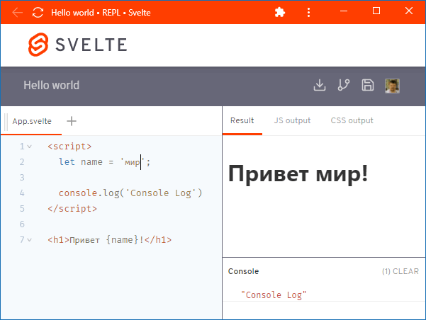

### Svelte REPL

[Svelte REPL](https://svelte.dev/repl/) - инструмент для изучения Svelte. Он позволяет попробовать различные подходы и проверить свои идеи, не запуская IDE и не создавая проекта. Удобнее всего использовать его в виде приложения, которое Chrome любезно предлагает установить:

Наш "исследовательский проект" может включать в себя произвольное (в пределах разумного, конечно) количество компонентов, которые могут быть вложенными друг в друга.

Мы можем сохранить свой проект в приложении, чтобы вернуться к нему через некоторое время. Таких сохраненных проектов может быть произвольно много. 

Кроме того, приложение позволяет скачать результат наших изысканий в виде zip-файла, который можно продолжать разрабатывать уже локально. (Отсюда, кстати, следует, что ещё один способ создать Svelte-проект - просто зайти на REPL и скачать "Hello world", который тот предлагает по умолчанию).

Можно перейти в галерею примеров, открывать интересующие нас в REPL и редактировать, пробуя различные варианты. Отредактированные примеры также можно сохранять в приложении или скачивать в виде zip-файла.
