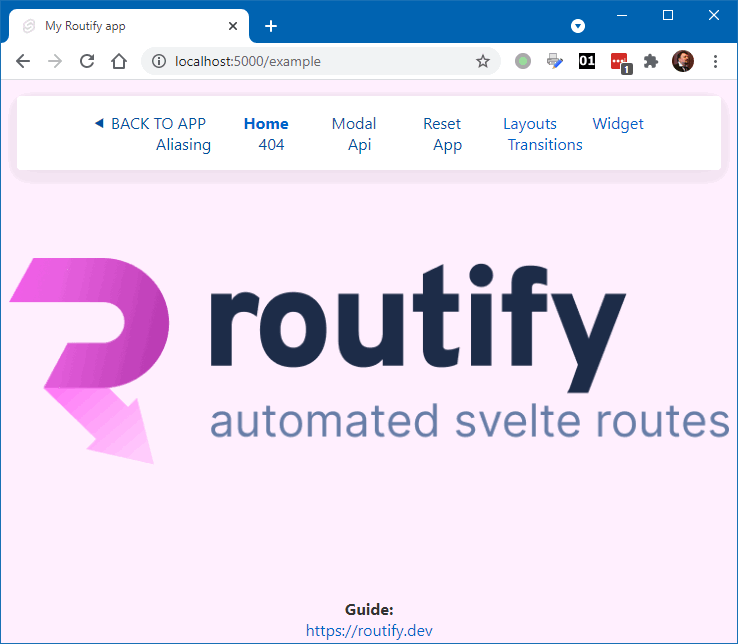
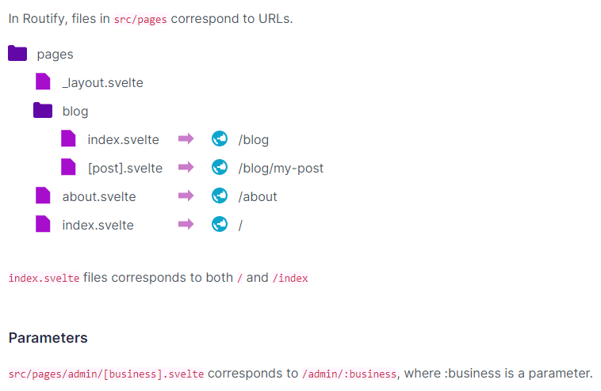

### Routify

Довольно навороченный роутер для Svelte v3:

* Богатый на фичи, например, поддерживает SSR (Server side rendering), SSG (Static site generation), PWA (Progressive web application), пререндеринг и авторизацию пользователей;
* Не требует сервера вроде Node, т. е. спокойно работает на статическом хостинге.

Развертывание шаблона:

```shell
npx @roxi/routify init
```

Далее как обычно `npm run dev` и т. д. Чтобы начать разработку собственного приложения, достаточно удалить папку `src/pages/examples`.



Роутятся страницы `*.svelte`, находящиеся в `src/pages`. Картинка, поясняющая роутинг в Routify:



