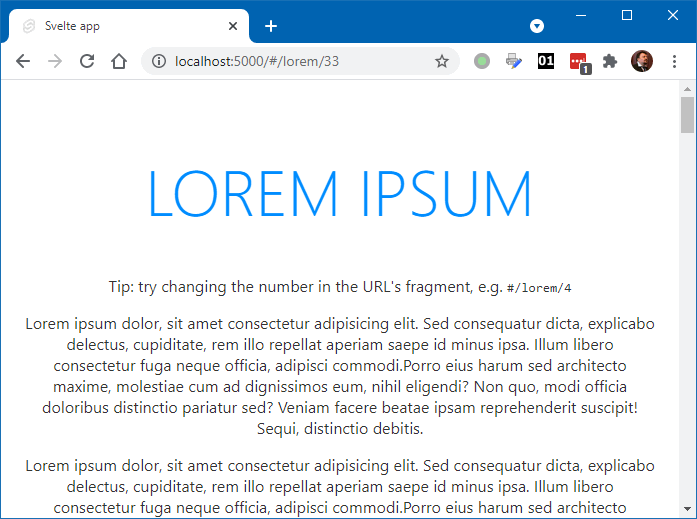

### Svelte SPA router

Простой, но вполне рабочий (для небольших приложений, не требующих авторизации или других заморочек) роутер для Svelte:

* Поддерживает Svelte v3;
* Предоставляет т. наз. hash-routing, т. е. ссылки на маршруты выглядят так: `#/route/params`;
* Не требует сервера вроде Node, спокойно работает на чисто статическом хостинге;
* Плохо дружит с SEO и поисковыми системами.

Развертывание шаблона:

```shell
npx degit italypaleale/svelte-spa-router-template hello-router
cd hello-router
npm i
npm run dev
```



Шаблон основан на [sveltejs/template](https://github.com/sveltejs/template).

**public/index.html**:

```html
<!DOCTYPE html>
<html lang="en">
<head>
	<meta charset='utf-8'>
	<meta name='viewport' content='width=device-width,initial-scale=1'>

	<title>Svelte app</title>

	<link rel='icon' type='image/png' href='/favicon.png'>
	<link rel='stylesheet' href='/global.css'>
	<link rel='stylesheet' href='/build/bundle.css'>

	<script defer src='/build/bundle.js'></script>
</head>

<body>
</body>
</html>
```

**App.svelte**:

```html
<script>
	import Router from 'svelte-spa-router';
	import routes from './routes';
</script>

<main>
	<Router {routes} />
</main>

<style>
	main {
		text-align: center;
		padding: 1em;
		max-width: 240px;
		margin: 0 auto;
	}

	@media (min-width: 640px) {
		main {
			max-width: none;
		}
	}
</style>
```

**main.js**:

```javascript
import App from './App.svelte';

const app = new App({
	target: document.body
});

export default app;
```

**routes.js**:

```javascript
import Home from './routes/Home.svelte';
import Lorem from './routes/Lorem.svelte';
import NotFound from './routes/NotFound.svelte';

export default {
    '/': Home,
    '/lorem/:repeat': Lorem,
    // The catch-all route must always be last
    '*': NotFound
};
```

**routes/Home.svelte**:

```html
<h1>Hello world!</h1>
<p>Visit the <a href="https://svelte.dev/tutorial">Svelte tutorial</a> to learn how to build Svelte apps.</p>
<p>
    This template is pre-configured with svlete-spa-router for routing.<br/>
    Visit the <a href="https://github.com/ItalyPaleAle/svelte-spa-router">documentation for the router</a> to learn more.
</p>
<p>
    <a href="#/lorem/2">Lorem ipsum</a>
</p>

<style>
	h1 {
		color: #ff3e00;
		text-transform: uppercase;
		font-size: 4em;
		font-weight: 100;
	}
</style>
```

**routes/Lorem.svelte**:

```html
<script>
    export let params = {};

    let repeat = 1;
    $: {
        repeat = 1
        if (params && params.repeat) {
            repeat = parseInt(params.repeat, 10)
            if (repeat < 1) {
                repeat = 1
            }
        }
    }
</script>

<h1>Lorem ipsum</h1>
<p>Tip: try changing the number in the URL's fragment, e.g. <code>#/lorem/4</code></p>
{#each Array(repeat) as _}
    <p>
        Lorem ipsum dolor, sit amet consectetur adipisicing elit. Sed consequatur dicta, explicabo delectus, cupiditate, rem illo repellat aperiam saepe id minus ipsa. Illum libero consectetur fuga neque officia, adipisci commodi.Porro eius harum sed architecto maxime, molestiae cum ad dignissimos eum, nihil eligendi? Non quo, modi officia doloribus distinctio pariatur sed? Veniam facere beatae ipsam reprehenderit suscipit! Sequi, distinctio debitis.
    </p>
{/each}

<style>
	h1 {
		color: #008cff;
		text-transform: uppercase;
		font-size: 4em;
		font-weight: 100;
	}
</style>
```

**NotFound.svelte**:

```html
<h1>Not Found</h1>
<p>This route doesn't exist.</p>

<style>
	h1 {
		color: #ff0040;
		text-transform: uppercase;
		font-size: 4em;
		font-weight: 100;
	}
</style>
```

Размер `public/bundle/bundle.js` для стартового шаблона **67044 байта**.
