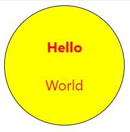

### Шаблон компонента Svelte

Шаблон представляет собой обычный HTML:

```html
<div class="foo">
    <button disabled>Can't touch this</button>
</div>
```

Значения атрибутов могут содержать произвольные выражения JavaScript, заключенные в фигурные скобки (впрочем, как и текст вне атрибутов):

```html
<a href="page/{p}">Link to page {p}</a>
```

Более того, они могут быть просто JavaScript-выражениями произвольной сложности. В этом случае их можно не заключать в кавычки:

```html
<button disabled={!clickable}>Some text</button>
<p>{a} + {b} = {a + b}</p>
<div>{ (/^[A-Za-z\s]+$/).test(value) ? x : y }</div>
```

Для булевых атрибутов работает правило: атрибут рендерится, если значение равно `true`, иначе он опускается.

Простое сокращение: если имя атрибута совпадает с переменной, задающей его значение, можно вместо `name={name}` писать просто `{name}`, Svelte расширит как надо:

```html
<button {disabled}>Some text</button>
```

Допускается оператор spread:

```html
<script>
    let things = {
        name: 'Name',
        disabled: false,
        width: "100%"
    };
</script>

<Widget {...things} />
```

### Комментарии

Шаблон может содержать как обычные HTML-комментарии:

```html
<!-- какой-то комментарий -->
```

так и комментарии, предназначенные для Svelte-компилятора:

```html
<!-- svelte-ignore a11y-autofocus -->
<input bind:value="{name" autofocus>
```

### Условный оператор

```html
{#if выражение} ... {/if}
{#if выражение} ... {:else if выражение} ... {/if} 
{#if выражение} ... {:else} ... {/if}
```

### Цикл по элементам массива

```html
{#each выражение as имя} ... {/each}
{#each выражение as имя, индекс} ... {/each}
{#each выражение as имя (ключ)} ... {/each}
{#each выражение as имя, индекс (ключ)} ... {/each}
{#each выражение as имя} ... {:else} ... {/each}
```

Простой пример:

```html
<h1>Список покупок</h1>
<ul>
    {#each items as item}
        <li>{item.name} x {item.qty}</li>
    {/each}
</ul>
```

Пример с индексом (от `0` до `length - 1` включительно):

```html
{#each item as item, i}
    <li>{i + 1}) {item.name} x {item.qty}</li>
{/each}
```

Пример с ключом (очень пригождается при удалении или редактировании элементов  в списке):

```html
{#each items as item (item.id)}
    <li>{item.name} x {item.qty}</li>
{/each}
```

Деструктуризация:

```html
{#each items as { id, name, qty }, i (id)}
    <li>{i + 1}) {name} x {qty}</li>
{/each}
```
или спрединг:

```html
{#each items as { id, ...rest } }
    <li><strong>{id}</strong><MyComponent {...rest} /></li>
{/each}
```

Если вдруг массив оказывается пустым:

```html
{#each todos as todo}
    <p>{todo.text}</p>
{:else}
    <p>Nothing to do!</p>
{/each}
```

### await

```html
{#await выражение} ... {:then имя} ... {:catch имя} ... {/await}
{#await выражение} ... {:then имя} ... {/await}
{#await выражение then имя} ... {/await}
{#await выражение catch имя} ... {/await}
```

Простой пример:

```html
{#await promise}
    <p>Ожидаем выполнения длительной операции</p>
{:then value}
    <p>Вот что получилось: {value}</p>
{:catch error}
    <p>Возникла ошибка: {error.message}</p>
{/await}
```

Если ошибка нас не волнует:

```html
{#await promise then value}
    <p>Вот что получилось: {value}</p>
{/await}
```

### key

Блок `#key` удаляет и пересоздает свое содержимое, когда меняется значение выражения. Это полезно для отображения всяческих переходов:

```html
{#key value}
    <div transition:fade>{value}</div>
{/key}
```

Когда блок `#key` окружает компонент, тот пересоздается и переинициализируется заново:

```html
{#key value}
    <Component />
{/key}
```

### Блок `@html`

Вывод HTML в "сыром виде":

```html
<div class="blog-post">
    <h1>{post.title}</h1>
    {@html post.content}
</div>
```

### Отладка с помощью `@debug`

```html
{@debug}
{@debug var1, var2, ...}
```

В Svelte предусмотрен инструмент отладки -- блок `@debug`. Во-первых, он выводит значения перечисленных переменных в `console.log` всякий раз, когда любая из них изменяет свое значение, во-вторых, если в браузере открыты инструменты разработчика, то приостанавливает выполнение скрипта. Если имена переменных опущены, точка останова срабатывает всякий раз, когда происходит изменение _любой_ переменной, входящей в состояние скрипта.

```html
<script>
    let user = {
        firstname: 'Ada',
        lastname: 'Lovelace'
    };
</script>

<h1>User profile</h1>
{@debug user}

<p>First name: {user.firstname}</p>
<p>Last name: {user.lastname}</p>
```

### Директивы элементов

#### on:eventname

```html
on:eventname={handler}
on:eventname|modifiers={handler}
```

Простой пример:

```html
<script>
    let count = 0;
    
    function handleClick(event) {
        count += 1;
    }
</script>

<button on:click={handleClick}>
    Count: {count}
</button>
```

Со стрелочной функцией:

```html
<button on:click="{() => count += 1}">
    Count: {count}
</button>
```

С модификаторами:

```html
<form on:submit|preventDefault={handleSubmit}>
    <input type="submit" value="Submit">
</form>
```

| Модификатор | Значение |
|-------------|----------|
| preventDefault | вызывает `event.preventDefault()` в начале обработчика |
| stopPropagation | вызывает `event.stopPropagation()` в начале обработчика |
| passive | улучшает производительность скроллинга на тач- и мышиных событиях. Svelte добавляет этот модификатор автоматически |
| nonpassive | отключает автоматический модификатор `passive` |
| capture | обработчик события будет вызван в фазе `capture`, а не `bubbling` как обычно |
| once | одноразовый обработчик события |
| self | вызывать обработчик только, если `event.target` равен самому элементу |
| trusted | обработчик запускается только, если `event.isTrusted` |

Если директива `on:` употребляется без указания обработчика, это означает, что событие должно быть переправлено вышестоящему компоненту, прослушивающему данное событие.

```html
<button on:click>
    Component itself will emit the click event
</button>
```

Для одного события можно иметь несколько обработчиков:

```html
<script>
    let counter = 0;
    
    function increment() {
        counter += 1;
    }
    
    function track(event) {
        trackEvent(event);
    }
</script>

<button on:click={increment} on:click={track}>
    Click me!
</button>
```

#### bind:property

Директива устанавливает двустороннее связывание значения свойства с переменной:

```html
<input bind:value={name}>
<textarea bind:value={text}></textarea>
<input type="checkbox" bind:checked={yes}>
```

Если имя переменной совпадает с именем свойства, можно использовать сокращенную форму:

```html
<input bind:value={value}>
<input bind:value>
```

Если `input` имеет тип `number`, Svelte выдает численное значение, иначе строковое.

Если `input` имеет тип `file`, Svelte выдает [`FileList`](https://developer.mozilla.org/en-US/docs/Web/API/FileList).

**Связывание `<select>`**. 

```html
<select bind:value={selected}>
    <option value={a}>a</option>
    <option value={b}>b</option>
    <option value={c}>c</option>
</select>
```

**Связывание с группой элементов**.

```html
<script>
    let tortilla = 'Plain';
    let fillings = [];
</script>

<input type="radio" bind:group={tortilla} value="Plain"/>
<input type="radio" bind:group={tortilla} value="Whole wheat"/>
<input type="radio" bind:group={tortilla} value="Spinach"/>

<input type="checkbox" bind:group={fillings} value="Rice" />
<input type="checkbox" bind:group={fillings} value="Beans" />
<input type="checkbox" bind:group={fillings} value="Cheese" />
<input type="checkbox" bind:group={fillings} value="Guac (extra)" />
```

**Связывание с элементом DOM**.

```html
<script>
    import { onMount } from 'svelte';
    
    let canvasElement;
    
    onMount(() => {
        const ctx = canvasElement.getContext('2d');
        drawStuff(ctx);
    })
</script>

<canvas bind:this={canvasElement}></canvas>
```

#### class:name

Синтаксический сахар для установки/удаления класса у элемента:

```html
class:name={value}
class:name
```

Пример:

```html
<!-- длинный способ -->
<div class={active ? 'active} : ''>...</div>

<!-- покороче -->
<div class:active={active}>...</div>

<!-- совсем коротко -->
<div class:active>...</div>

<!-- много классов у одного элемента -->
<div class:active class:current class:discount>...</div>
```

#### use:action

В момент создания элемента DOM можно выполнить над ним некоторое действие:

```html
<script>
    export let baz;
    
    function foo(node, bar) {
        console.log("Элемент создан:", node, bar);
        
        return {
            update(bar) {
                console.log("Элемент обновляется:", node, bar);
            },
            
            destroy() {
                console.log("Элемент удален:", node, bar);
            }
        };
    }
</script>

<div use:foo={baz}>...</div>
```

### transition:fn

```typescript
transition:fn
transition:fn={params}
transition:fn|local={params}
transiion = (node: HTMLElement, params: any => {
    delay?: number, 
    duration?: number,
    easing?: (t: number) => number,
    css?: (t: number, u: number) => string,
    tick?: (t: number, u: number) => void    
}
```

Эффекты перехода. Пример:

```html
<script>
    import { fade } from 'svelte/transition'

    let visible = false;
</script>


<button on:click={() => {visible = !visible}}>Нажми меня!</button>
<br/>

{#if visible}
<div transition:fade>У попа была собака.</div>
{/if}
```

Аналогично `transition` задаются директивы `in` и `out`. Их основное отличие в том, что:

* `transition` срабатывает и при появлении и при исчезновении элемента;
* `in` срабатывает только при появлении элемента;
* `out` срабатывает только при исчезновении элемента.

### slot

Компонент Svelte может представлять собой нечто вроде контейнера для контента, вкладываемого в него внешним компонентом. Например, он может отрисовывать красивую рамку вокруг контента. Или рисовать круг:

**`Circle.svelte`**:

```html
<div>
    <slot/>
</div>

<style>
div {
    width:200px;
    height:200px;
    background-color:yellow;
    color:red;
    border: thin solid black;
    display: flex;
    flex-direction: column;
    justify-content: center;
    align-items: center;
    border-radius: 100%;
    font-size: 18pt;
}
</style>
```

**`App.svelte`**:

```html
<script>
    import Circle from './Circle.svelte';
</script>

<Circle>
    <div>
        <strong>Hello</strong>
    </div>
    <br/>
    <div>
        World
    </div>
</Circle>
```

Получается вот что:


