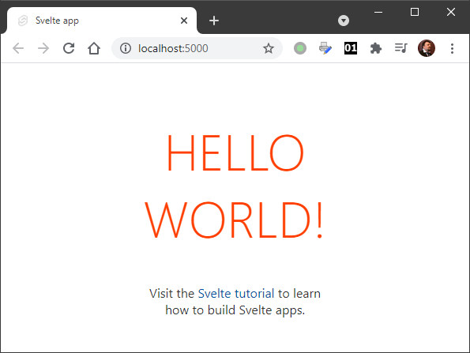

### Исчезающий фреймворк Svelte

```shell
npx degit sveltejs/template hello-svelte
cd hello-svelte
npm install
npm run dev
```



`main.js`:

```javascript
import App from './App.svelte';
 
const app = new App({
    target: document.body,
    props: {
        name: 'world'
    }
});
 
export default app;
```

`App.svelte`:

```html
<script>
    export let name;
</script>
 
<main>
    <h1>Hello {name}!</h1>
    <p>Visit the <a href="https://svelte.dev/tutorial">Svelte tutorial</a> to learn how to build Svelte apps.</p>
</main>
 
<style>
    main {
        text-align: center;
        padding: 1em;
        max-width: 240px;
        margin: 0 auto;
    }
 
    h1 {
        color: #ff3e00;
        text-transform: uppercase;
        font-size: 4em;
        font-weight: 100;
    }
 
    @media (min-width: 640px) {
        main {
            max-width: none;
        }
    }
</style>
```
Как собрать приложение:

```shell
npm run build
```

Получаем `public/build/bundle.js` размером 3346 байт. Неплохо!

Простейшее приложение, считающее клики по кнопке:

```html
<script>
    let count = 0;
</script>
 
<main>
    <h1>Count = {count}</h1>
    <button on:click={() => count += 1}>++</button>
</main>
 
<style>
    main {
        text-align: center;
        padding: 1em;
        margin: 0 auto;
    }
 
    h1 {
        color: #ff3e00;
        text-transform: uppercase;
        font-size: 4em;
        font-weight: 100;
    }
 
</style>
```
Традиционный калькулятор, складывающий два числа:

```html
<script>
    let first = 123;
    let second = 345;
         
    $: summa = first + second;
</script>
 
<main>
    <input type="number" bind:value="{first}"><br/>
    <input type="number" bind:value="{second}"><br/>
    <input type="number" readonly value="{summa}">
</main>
 
<style>
    main {
        padding: 1em;
        margin: 0 auto;
    }
</style>
```
