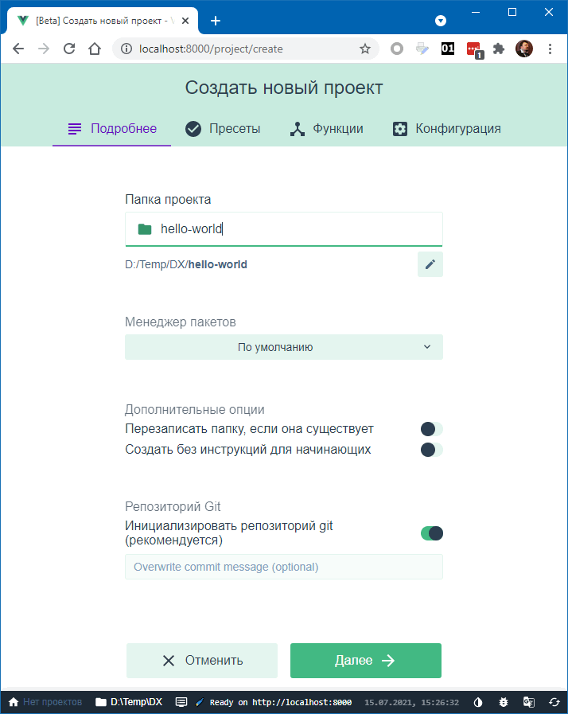
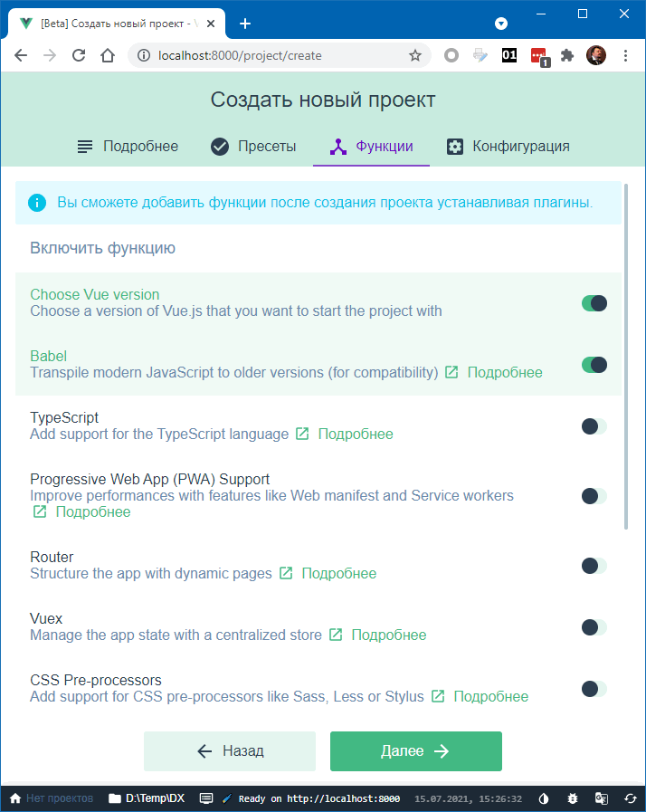
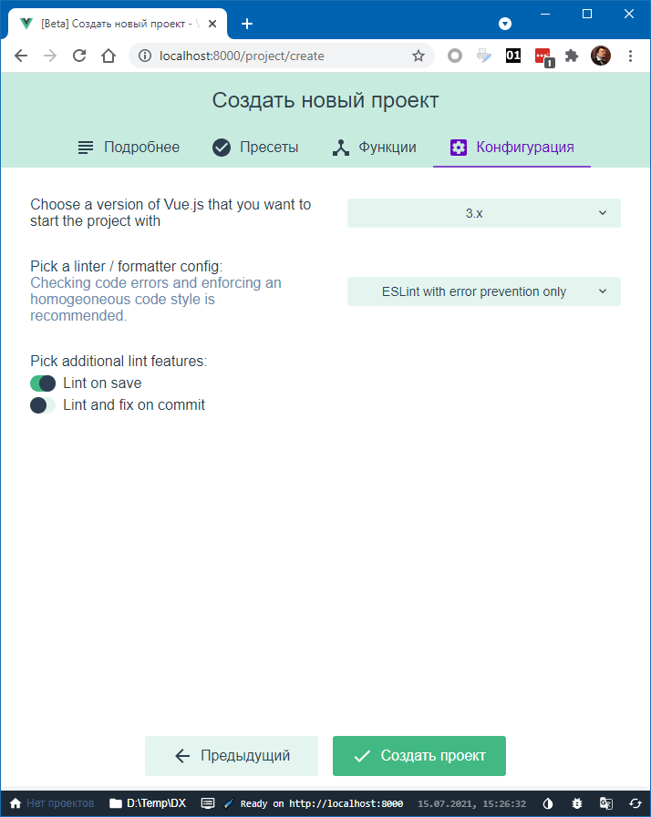
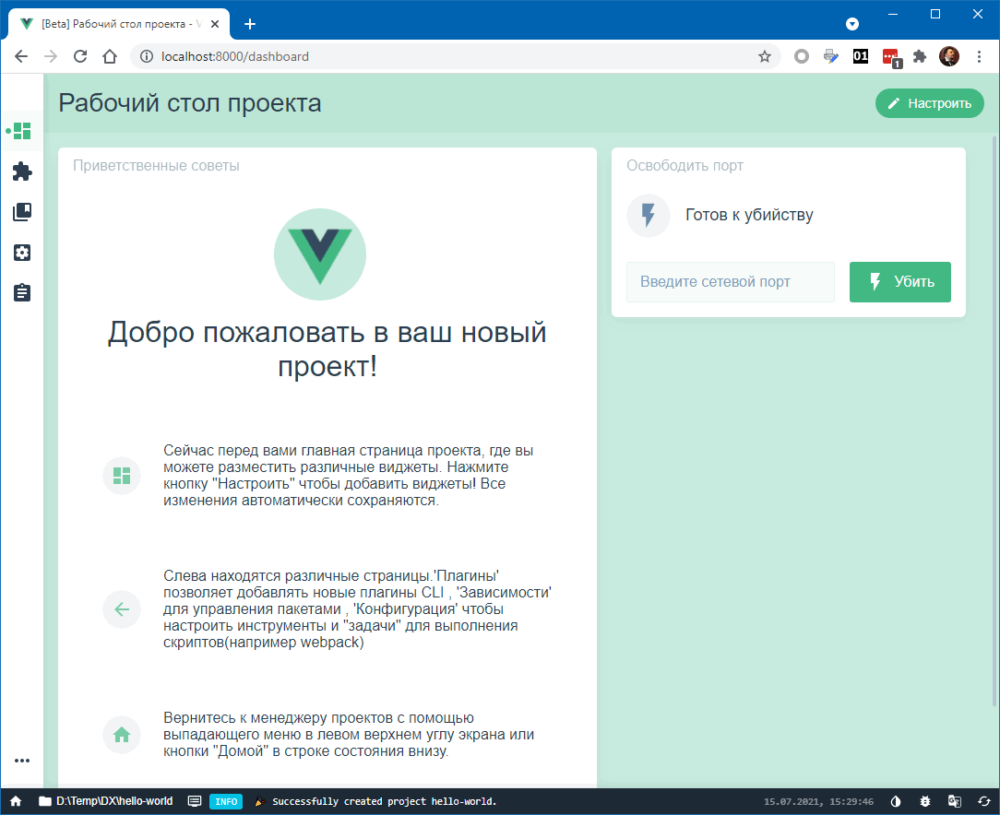
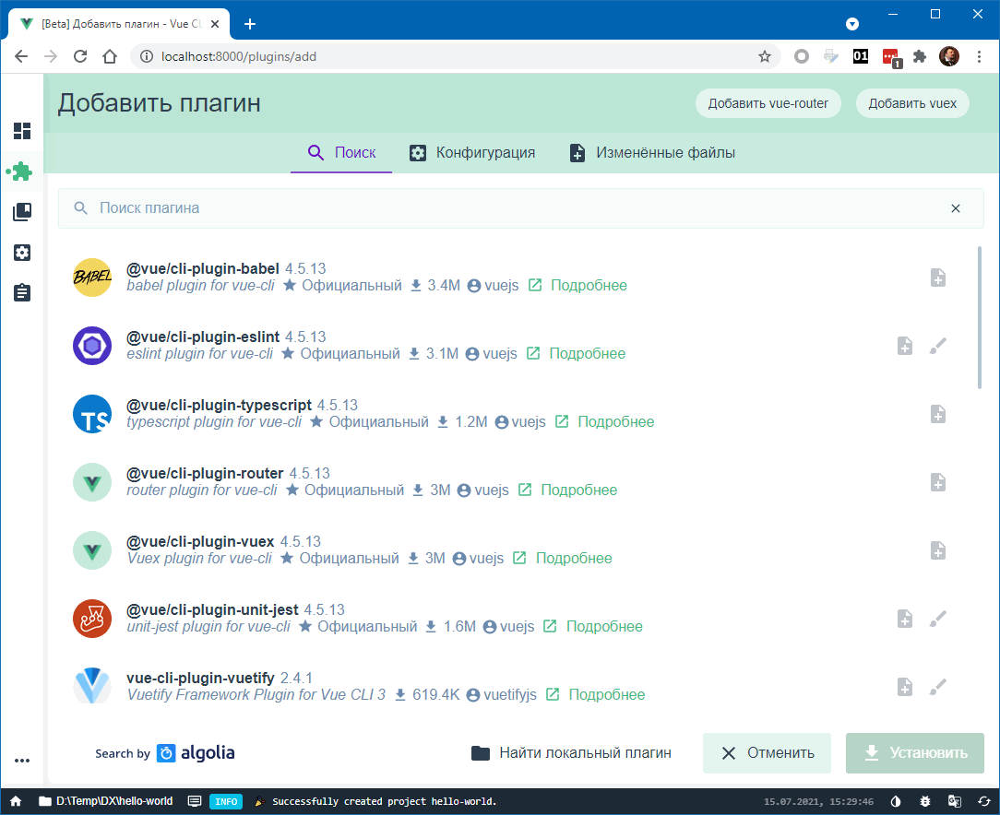
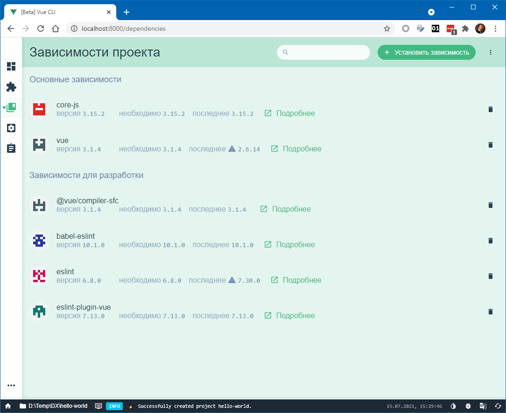
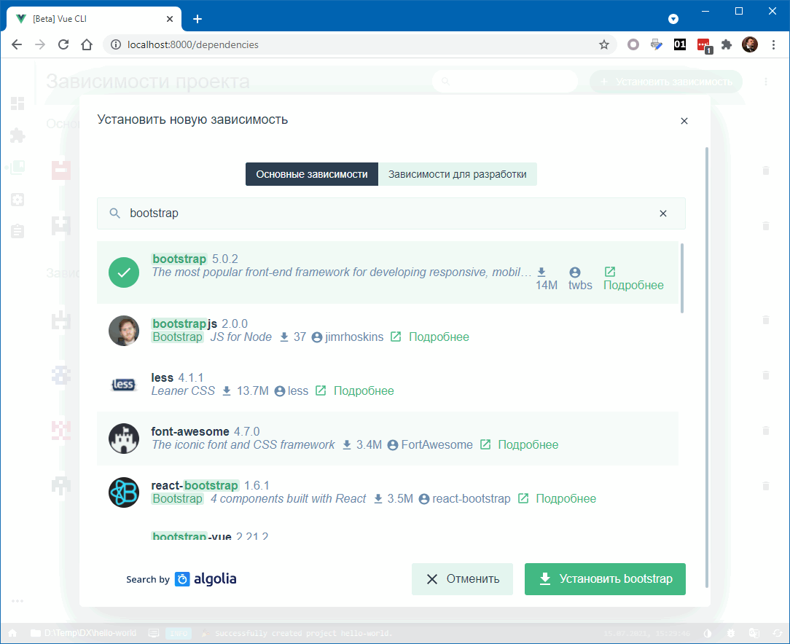
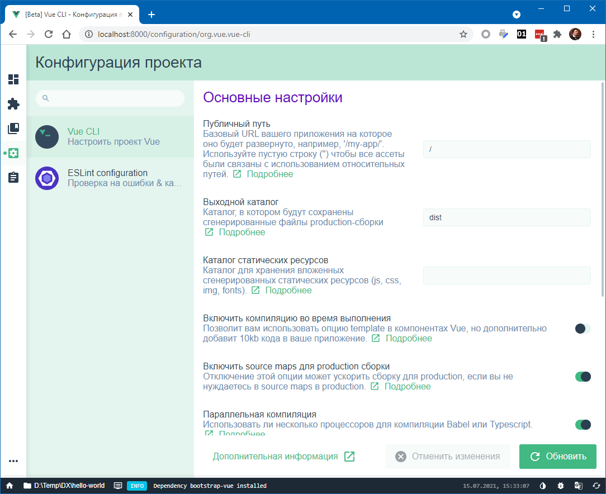

### @vue-cli со всеми удобствами

Развращение разработчиков достигло таких глубин, что создавать приложение Vue.js теперь можно со всеми возможными удобствами прямо в браузере 🙂

Для этого достаточно подать команду vue ui (конечно же, перед этим необходимо установить пакет `@vue/cli`, если он ещё не установлен. И тогда появляется замечательнейший диалог, в котором можно задать любые мыслимые опции

Можно включать/выключать многочисленные опции, например, роутинг и VueX:

Само собой, можно выбрать версию Vue.js и настройки линтера

Создав приложение, диалог «порадует» нас сообщением, что он готов убивать (на самом деле это означает просто, что можно запустить приложение и посмотреть в браузере, что получилось).

В уже созданное приложение можно добавить плагин

или Node-пакет (например, bootstrap)

или изменить настройки проекта

Короче, очень удобный инструмент, надо пользоваться! 🙂
