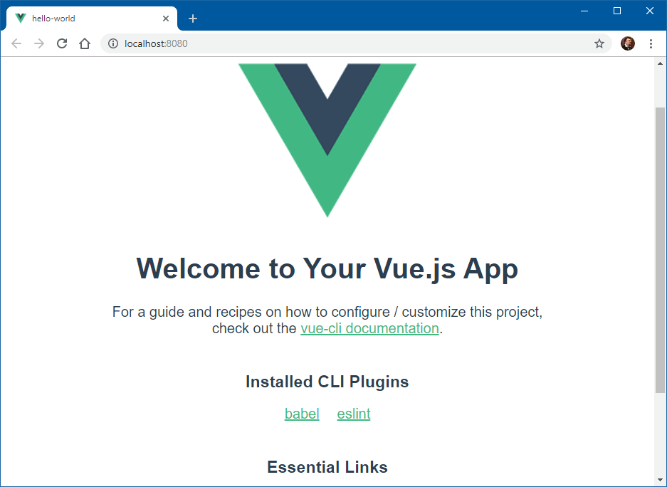
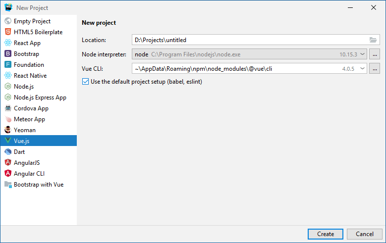

### Vue.js при помощи @vue/cli

[Vue CLI](https://cli.vuejs.org/) -- система для быстрой разработки на Vue.js, предоставляющая:

* Интерактивное создание проекта;
* Быстрое прототипирование без конфигурации;
* Возможность обновления;
* Webpack с оптимальными настройками по умолчанию;
* Настройка с помощью конфигурационного файла в проекте;
* Расширяемость плагинами;
* Большая коллекция официальных плагинов, интегрирующих лучшие инструменты экосистемы фронтенда.
* Полноценный графический пользовательский интерфейс для создания и управления проектами Vue.js.

Vue CLI требуется Node.js версии 8.9 или выше (рекомендуется 8.11.0+). Устанавливается элементарно (процесс занимает пару минут):

```
$ npm install -g @vue/cli
+ @vue/cli@4.0.5
added 1045 packages from 627 contributors in 113.289s

$ vue --version
@vue/cli 4.0.5
```

Каркас нового проекта создаётся буквально в пару нажатий клавиш, он сразу готов к употреблению (процесс занимает минуты три):

```
$ vue create --no-git --default hello-world</b>
added 1126 packages from 819 contributors and audited 24112 packages in 92.142s

$ cd hello-world
$ npm run serve
  App running at:
  - Local:   http://localhost:8080/
  - Network: http://192.168.7.9:8080/

  Note that the development build is not optimized.
  To create a production build, run npm run build.
```

Приложение выглядит так:



В папке проекта появились файлы `.gitignore`, `babel.config.js`, `package.json`, `README.md` и три подпапки: `node-modules` (там сложены необходимые для @vue/cli модули, нам там делать нечего), `public` (в ней файл `index.html` и `favicon.ico`) и `src` (там сложены исходные тексты, которые нам предстоит править).

Чтобы собрать production-версию сайта, надо отдать команду

```
$ npm run build
 DONE  Compiled successfully in 11067ms                                                                                                                                       

  File                                 Size               Gzipped

  dist\js\chunk-vendors.e2d460a4.js    88.28 KiB          31.62 KiB
  dist\js\app.c40a547e.js              4.62 KiB           1.64 KiB
  dist\css\app.e2713bb0.css            0.33 KiB           0.23 KiB

  Images and other types of assets omitted.

 DONE  Build complete. The dist directory is ready to be deployed.
 INFO  Check out deployment instructions at https://cli.vuejs.org/guide/deployment.html
```

WebStorm поддерживает работу с Vue-проектами:

