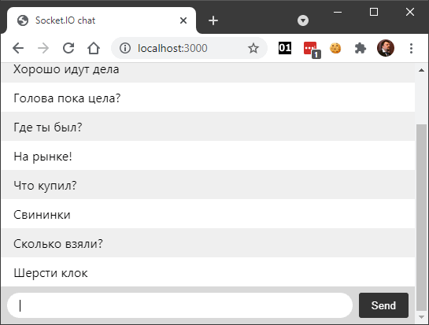

1. Создаем новый проект

```shell
npm init
```

такой:

```json
{
  "name": "socket-chat",
  "version": "1.0.0",
  "description": "simple chat with socket.io",
  "main": "server.js",
  "scripts": {
    "start": "node server.js"
  },
  "keywords": [],
  "author": "Alexey Mironov",
  "license": "ISC"
}
```

Добавляем `express`:

```shell
npm install express
```

Сочиняем `index.html` следующего содержания:

```html
<!DOCTYPE html>
<html lang="en">
  <head>
    <title>Socket.IO chat</title>
    <style>
      body { 
          margin: 0; 
          padding-bottom: 3rem; 
          font-family: -apple-system, BlinkMacSystemFont, "Segoe UI", Roboto, Helvetica, Arial, sans-serif; 
      }

      #form { 
          background: rgba(0, 0, 0, 0.15); 
          padding: 0.25rem; 
          position: fixed; 
          bottom: 0; 
          left: 0; 
          right: 0; 
          display: flex; 
          height: 3rem; 
          box-sizing: border-box; 
          backdrop-filter: blur(10px); 
      }
      
      #input { 
          border: none; 
          padding: 0 1rem; 
          flex-grow: 1; 
          border-radius: 2rem; 
          margin: 0.25rem; 
      }
      
      #input:focus { 
          outline: none; 
      }
      
      #form > button { 
          background: #333; 
          border: none; 
          padding: 0 1rem; 
          margin: 0.25rem; 
          border-radius: 3px; 
          outline: none; 
          color: #fff; 
      }

      #messages { 
          list-style-type: none; 
          margin: 0; 
          padding: 0; 
      }
      
      #messages > li { 
          padding: 0.5rem 1rem; 
      }
      
      #messages > li:nth-child(odd) {
          background: #efefef; 
      }
        
    </style>
  </head>
  <body>
    <ul id="messages"></ul>
    <form id="form" action="">
      <input id="input" autocomplete="off" /><button>Send</button>
    </form>
  </body>
</html>
```

Излагаем `server.js` в следующей редакции:

```javascript
const express = require('express');
const app = express();
const http = require('http');
const server = http.createServer(app);

app.get('/', (req, res) => {
    res.sendFile(__dirname + '/index.html');
});

server.listen(3000, () => {
    console.log('listening on *:3000');
});
```

Если теперь подать команду `npm run start`, мы увидим на [http://localhost:3000](http://localhost:3000) пустой (неработающий) чат. Это значит, пришла пора подключать `socket.io`.

```shell
npm install socket.io
```

Сервер дорабатываем до состояния:

```javascript
const express = require('express');
const app = express();
const http = require('http');
const server = http.createServer(app);
const { Server } = require("socket.io");
const io = new Server(server);

app.get('/', (req, res) => {
  res.sendFile(__dirname + '/index.html');
});

io.on('connection', (socket) => {
  console.log('a user connected');
});

server.listen(3000, () => {
  console.log('listening on *:3000');
});
```

Теперь при попытке пользователя подключиться к чату в консоль будет выводиться диагностическое сообщение.

В конец `index.html` (перед закрывающим тегом `body`) добавляем загрузку браузерной версии `socket.io`:

```html
<script src="/socket.io/socket.io.js"></script>
```

и обработку действий пользователя

```html
<script>
  var socket = io();

  var messages = document.getElementById('messages');
  var form = document.getElementById('form');
  var input = document.getElementById('input');

  form.addEventListener('submit', function(e) {
      e.preventDefault();
      if (input.value) {
          socket.emit('chat message', input.value);
          input.value = '';
      }
  });

  socket.on('chat message', function(msg) {
      var item = document.createElement('li');
      item.textContent = msg;
      messages.appendChild(item);
      window.scrollTo(0, document.body.scrollHeight);
  });
</script>
```

В сервере достаточно добавить перед вызовом `listen` всего несколько строк

```javascript
io.on('connection', (socket) => {
    console.log('a user connected');

    socket.on('disconnect', () => {
        console.log('user disconnected');
    });

    socket.on('chat message', (msg) => {
        console.log('message: ' + msg);
        io.emit('chat message', msg);
    });
});
```

Вот что должно получиться в итоге:


