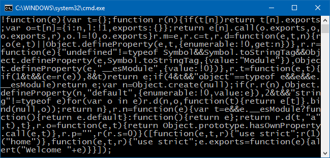
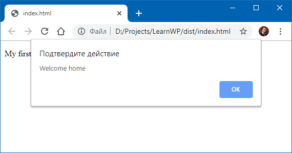

### Webpack

[Webpack](https://webpack.js.org/) -- система сборки веб-проектов, которая умеет собирать веб-сайт из кусков JsavScript, CSS и всякого прочего, из чего состоят современные сайты. При сборке Webpack может вызывать различные препроцессоры, упаковщики, линтеры и миллион других штуковин, которые могут потребоваться для современного сайта. Всё упирается лишь в желание разработчика заскриптовать нужные действия. Короче, штука нужная, надо изучать. :)

Webpack представляет собой модуль Node.js, поэтому последний придётся поставить (и чем новее версия, тем лучше). Сам Webpack устанавливается стандартным заклинанием <code>npm i -g webpack</code>.

Начнём с простейшего -- сборки модулей JavaScript. Допустим, у нас есть проект со следующими файлами: `index.html`:

```html
<!DOCTYPE html>
<html lang="en">
<head>
  <meta charset="UTF-8">
  <!-- bundle.js будет создан Webpack -->
  <script src="bundle.js"></script>
</head>
<body>
  <p>My first page</p>
</body>
</html>
```

`main.js` (точка входа):

```javascript
'use strict';

let welcome = require('./welcome.js');

welcome('home');
```

`welcome.js` (некий модуль):

```javascript
'use strict';

module.exports = function (message) {
    alert("Welcome " + message);
};
```

Создаём файл конфигурации для Webpack `webpack.config.js`:

```javascript
'use strict';

module.exports = {
    entry: './main',
    output: {
        filename: 'bundle.js'
    }
};
```

Собираем:

```
> webpack --mode production
Hash: ec886050ca2455e1ebbf
Version: webpack 4.41.2
Time: 116ms
Built at: 2019-11-01 17:56:11
    Asset      Size  Chunks             Chunk Names
bundle.js  1.01 KiB       0  [emitted]  main
Entrypoint main = bundle.js
[0] ./main.js 77 bytes {0} [built]
[1] ./welcome.js 94 bytes {0} [built]
```

Вот какую кашу сварил в итоге Webpack :)



Несмотря на устрашающий вид, делает она то, что от неё ожидается:


